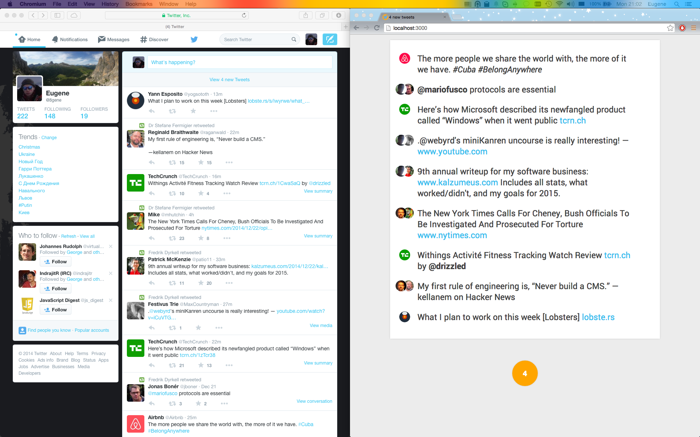

# README #

Twic is a simple reader of a Twitter user's home feed. It's main goal is a search of a better Twitter feed usage experience. Currently it has next features:

- reasonably minamalistic visual appearance, with just a list of tweets and a Refresh button - a single button application :-)

- every tweet item displays also a minimal set of data - only author's avatar and a tweet text;

- tweet text is rendered with minimal visual distractions, using only a basic typography;

- tweet's embedded content if any is shown directly, without a need to click on it to expand;

- older tweets are on the top, newer on the bottom, providing a most natural way for reading;

- read tweets are not shown. Once a user reads to the bottom of the feed he/she sees a Refresh button with a count of new, yet unread tweets. After clicking on the button the old, already seen tweets are replaced with new ones;

- the Refresh button is grey if there are no new tweets in a feed, or orange if there are new itwems;

- font size is reasonably larger;

- links are resolved and shown as on a Hacker News - just domains;

- extra options and data are shown on mouse over;

- uses Twitter streaming API and websockets and client side storage to react instantly on user input.

All the checks are done automatically in background. User has a very simple workflow - if the single button in user interface is orange, then he/she may click on it and get new tweets. The button becomes grey until next tweets will be available.

Compare with the original Twitter UI:



# Run

Go to https://apps.twitter.com/ and create a new app, consumer key and access token. Access level may be read only, or read and write if you would like to make a retweets. Then run this in a shell:

```
$ git clone https://github.com/EugeneN/twic.git
$ cd twic
```
Put *Consumer Key (API Key)*, *Consumer Secret (API Secret)*, *Access Token*, *Access Token Secret* into a `Config.hs` file. Run next commands:

```
$ cabal sandbox init
$ cabal install --only-dependencies
$ cabal build
$ cd src/UI/HTTP/cs && npm install && bower install && grunt && cd -
$ ./dist/build/twic/twic serve 0
```
Go to [http://localhost:3000/](http://localhost:3000/)

# TODO

A lot. 
