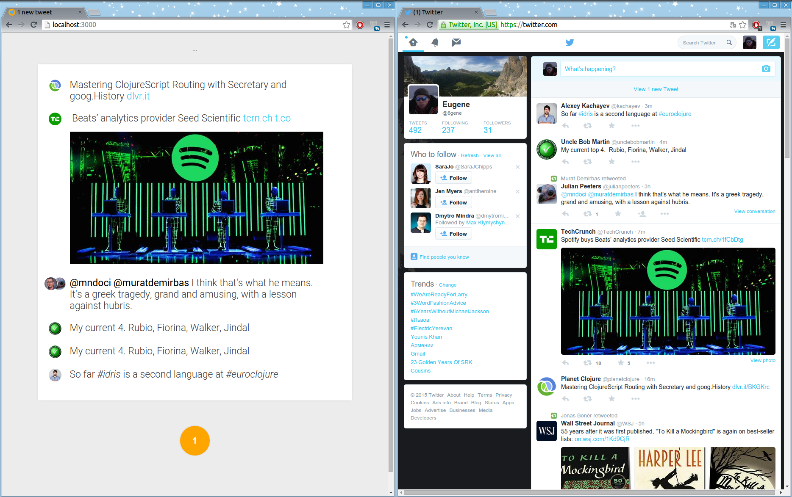

# README #

Twic is a simple reader of a Twitter user's home feed. It's main goal is a search of a better Twitter feed usage experience. Currently it has the following features:

- reasonably minamalistic visual appearance, with just a list of tweets and a Refresh button - a single button application :-)

- every tweet item displays also a minimal set of data - only author's avatar and a tweet text;

- tweet text is rendered with minimal visual distractions, using only a basic typography;

- tweet's embedded content if any is shown directly, without a need for extra click on it to expand;

- older tweets are on the top, newer on the bottom, providing a most natural way for reading;

- read tweets are not shown. Once a user reads to the bottom of the feed he/she sees a Refresh button with a count of new, yet unread tweets. After clicking on the button the old, already seen tweets are replaced with new ones;

- the Refresh button is grey if there are no new tweets in a feed, or orange if there are new itwems - a one glance one click usage pattern;

- font size is reasonably larger;

- links are resolved and shown as on a Hacker News - just domains;

- extra options and data are shown on mouse over;

- uses Twitter streaming API and websockets and client side storage to provide instant and real time reaction for user input;

- gentle animations here and there to exploit user's muscle memory and continuity feeling;

- can be operated using only a mouse, or only a keyboard, or both - either way with minimal amount of actions required.

All the checks and feed tracking are done automatically and are invisible for the user. Thus user has a very simple workflow - if the single button in the UI is orange, then he/she may click on it and get new tweets. The button becomes grey until next tweets will be available.

Compare with the original Twitter UI:



Twic has also a more advanced features - posting new tweets, retweeting, starring tweets, replying, old feed view up to the beginning. Filtered feed views and conversation views are planned.

# Run

### *I don't want to compile anything, let me just download and run it:*

See [https://github.com/EugeneN/twic/wiki/Quick-start](https://github.com/EugeneN/twic/wiki/Quick-start)


### *My interests are more unconventional:*


Run this in a shell:

```
$ git clone https://github.com/EugeneN/twic.git
$ cd twic
$ cd src/UI/HTTP/cs && npm install && bower install && grunt && cd -
$ stack install
```

or the hard way:

```
$ cabal sandbox init
$ cabal install --only-dependencies
$ cd src/UI/HTTP/cs && npm install && bower install && grunt && cd -
$ cabal build
```

Provide your auth details using this instrunction: [https://github.com/EugeneN/twic/wiki/Quick-start#how-to-configure-and-run-twic](https://github.com/EugeneN/twic/wiki/Quick-start#how-to-configure-and-run-twic)

Run:

```
$ stack run twic serve
```

or, if built with cabal:

```
$ ./dist/build/twic/twic serve
```

Go to [http://localhost:3000/](http://localhost:3000/)

# TODO

A lot.
